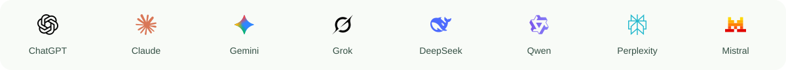
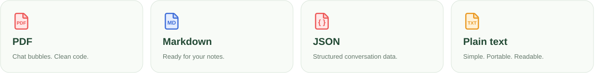

  

**ChatGPT & Claude Exporter – PDF & Markdown**

Export AI conversations to Markdown, JSON, Text and PDF

 

## One extension. Your favorite AI.

Save the conversation you have open, choose the messages that matter, and take them into your notes, documents or next project.

## Four ways to keep it

**Keep what matters.**

[Privacy policy](PRIVACY.md) · [Publishing guide](docs/PUBLISHING.md) · [Store listing](docs/STORE-LISTING.md) · [Third-party notices](THIRD-PARTY-NOTICES.txt)

Independent extension. Not affiliated with OpenAI, Anthropic or the other supported AI providers. Provider marks retain their original artwork and colors. README wave animation is decorative; its static frame remains readable.

